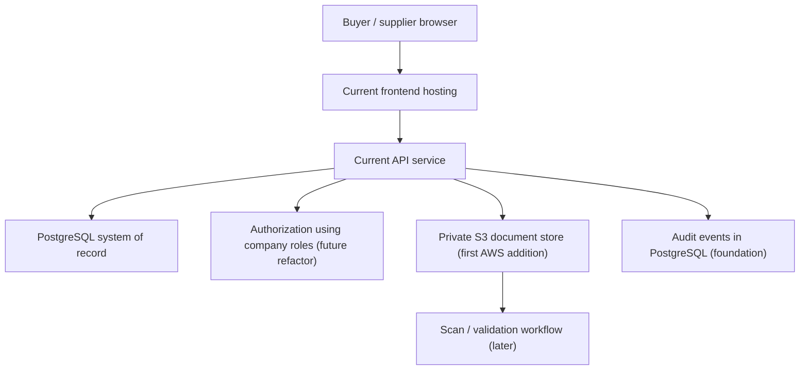

# Architecture Decision: Platform Foundation Direction

## Status

Decision for foundation planning: **keep the existing product and PostgreSQL,
refactor the foundation, and adopt AWS selectively rather than migrate the
backend now.**

This decision records architecture direction only. It does not change code,
schema, deployment configuration or cloud resources.

## Context

Chemidot is a B2B chemical marketplace moving beyond MVP toward a credible,
controlled product for chemical buyers, suppliers and investor review. The
current repository contains:

- A Vite/React frontend in `artifacts/chemidot`.
- An Express API in `artifacts/api-server`.
- PostgreSQL access using Drizzle ORM and `pg` in `lib/db`.
- Marketplace workflows for catalogue, RFQ, quotation/negotiation, orders,
  collective orders, supplier subscription visibility, messaging and admin.
- Deployment configuration for Vercel and Render.

The target product will need structured chemical requirements, controlled
documents, organization permissions, auditable transactions and dependable
operational controls. Those needs affect data modeling before they justify a
hosting migration.

## Current Architecture Summary

| Layer | Current implementation | Audit interpretation |
| --- | --- | --- |
| Frontend | Vite React app; same-origin API support and optional `VITE_API_URL` | Adequate MVP client boundary |
| API | Express routes with JWT bearer authentication, rate limiting and route-level capabilities | Usable service boundary; permission model must mature from personal users to companies |
| Database | PostgreSQL with Drizzle schema and migrations | Strong relational foundation; schema must be professionalized |
| Auth | `users` with `role`, `can_buy`, `can_sell`; JWT using configured secret | Supports MVP modes, not enterprise membership/approvals |
| Documents | URLs on products/orders/supplier docs; disk upload for supplier images | Not adequate for private chemical or transaction documents |
| Deployment | Vercel build/rewrites and Render web/database config | Both viable for current app, but database-push-in-build behavior is a material control risk |

## Decision Answers

| Question | Decision | Reason |
| --- | --- | --- |
| Is PostgreSQL a good fit for Chemidot? | **Yes. Keep it.** | Companies, products, RFQs, quotes, awards, orders, invoices, fulfillment and audit records are relational and require integrity and reporting. |
| Is the current schema usable for a professional B2B chemical marketplace? | **Usable as an MVP base, not sufficient as-is.** | It represents core workflows but lacks company ownership, compliance/document control, structured chemical requirements and complete commercial traceability. |
| What tables/entities are missing for chemicals? | **Substances/variants/specifications, controlled SDS/TDS/COA/compliance documents, company verification, lots/batches, shipments and audits are key gaps.** | Chemical trade needs safety, quality, regulatory and delivery evidence tied to transactions. |
| Should we move to AWS now or later? | **Later, incrementally.** | Correcting the model and controls first avoids moving unclear behavior into more infrastructure. |
| Should we use DynamoDB now? | **No.** | Current workflows are highly relational and still evolving; a DynamoDB redesign would require fixed access patterns and denormalized transaction modeling before foundation questions are settled. |
| Should we rebuild from scratch? | **No.** | The application already contains useful domain flows and a sensible relational base; targeted refactoring is lower risk and faster to validate. |
| Safest investor-ready path? | **Stabilize controls and data model, add private documents, demonstrate an auditable pilot flow, then decide infrastructure expansion from evidence.** | Investor readiness depends on control, compliance and repeatable transactions more than a premature platform rewrite. |

## PostgreSQL Suitability Decision

PostgreSQL should remain Chemidot's source of truth for operational
transactions. The product domain requires relationships and integrity across:

- Company membership and authorization.
- Supplier verification and certification history.
- Chemical products, specifications and controlled documents.
- RFQ competition, quote versioning, awards and orders.
- Invoices, payments, shipments, batches and audit events.

PostgreSQL allows the domain model to evolve while preserving referential
integrity and supports reporting needed for marketplace operations and
investor evidence. If Chemidot later chooses an AWS-managed database,
PostgreSQL remains portable to options such as Amazon RDS for PostgreSQL or
PostgreSQL-compatible managed alternatives without redesigning the domain.

## DynamoDB Decision: Do Not Migrate Now

DynamoDB is not rejected as a technology; it is rejected as the primary
transactional database change for this stage.

AWS guidance states that DynamoDB modeling starts from known application access
patterns and commonly uses aggregation/denormalization rather than the
normalized relational design used today. Chemidot is currently defining new
company, compliance, document, payment, fulfillment and audit relationships.
A migration now would require simultaneously redesigning both the business
model and the persistence strategy.

Potential future DynamoDB uses can be evaluated independently if a proven
high-scale access pattern appears, such as event projections, idempotency keys
or specialized notification/read models. It should not replace PostgreSQL for
the evolving system of record now.

## AWS Target Architecture Direction

AWS should be introduced as a capability strategy, not as an immediate backend
move:

| Timing | Direction |
| --- | --- |
| Now | Retain application hosting and PostgreSQL while mapping the professional data model and correcting operational risk. |
| First practical AWS step | Use a private Amazon S3 bucket for controlled chemical and commercial documents after a document authorization model is defined. |
| Next, when justified | Add encryption/key management, malware scanning workflow, audit logging and lifecycle/retention around document storage. |
| Later decision | Evaluate moving API compute and/or PostgreSQL hosting to AWS only against compliance, networking, performance, operations and cost requirements. |

### Recommended First AWS Step: Private S3 Documents

Private S3 storage aligns with the clearest current gap: SDS/TDS/COA,
verification and invoice documents are presently URLs without a controlled
private repository. The implementation plan should require:

- S3 Block Public Access enabled and private objects by default.
- Object keys stored in a versioned `documents` model, not permanent public
  URLs as the system of record.
- Application-authorized, short-lived presigned upload/download operations.
- Checksums, content-type/file-size controls, malware scanning, encryption,
  access events and retention/version policy.
- Access rules differentiating public marketing content from confidential
  supplier, RFQ, order and compliance evidence.

This is a bounded AWS improvement that supports the business without forcing a
database or API migration.

## Vercel Versus AWS Recommendation

Do not treat this as a binary hosting decision yet.

| Capability | Recommendation now | Later trigger to reconsider |
| --- | --- | --- |
| Web frontend | Keep current hosting pattern if delivery is stable | Regulatory/networking, enterprise security or cost requirements change |
| Express API | Keep until domain refactor and operational controls are stable | Need for AWS private networking, service decomposition, workload controls or compliance architecture |
| PostgreSQL | Keep PostgreSQL; do not change engine | Consider managed AWS PostgreSQL only with an operations/compliance case and migration plan |
| Documents | Do not rely on runtime local storage for protected files | Implement private S3 as the first AWS workload once document model/access policy is ready |
| Events/analytics | Keep simple until transactions are reliable | Add event/reporting architecture after canonical audit events exist |

Vercel Functions provide writable temporary `/tmp` scratch space, not durable
private document storage. The current upload approach therefore should not
become the foundation for chemical evidence files.

## Recommended Hybrid Architecture

### What Should Stay Now

- Existing product codebase and user-facing marketplace functionality.
- PostgreSQL and Drizzle as the transaction foundation.
- RFQ, quotation, negotiation, ordinary order and collective-order concepts.
- Current deployment topology while it is reviewed and hardened.

### What Should Move Or Change Later

- Chemical and transaction document binary storage to private S3.
- Company/permissions, compliance and transaction traceability through
  carefully designed schema evolution.
- Database hosting or API compute to AWS only after requirements and operational
  ownership are explicit.
- Specialized services only where measured traffic, regulatory requirements or
  operating risk justify them.

## Foundation Risks Observed

| Risk | Evidence observed | Required follow-up, not performed in this audit |
| --- | --- | --- |
| Schema mutation coupled to deployment | Render build command calls DB push; root Vercel build script conditionally runs forced DB push and baseline inserts when a database URL is configured | Separate migrations from build/deploy; require controlled release procedure and backups |
| Documents are not private controlled records | `supplier_documents.file_url`, product SDS URL and invoice URL fields; supplier image writes to runtime disk or `/tmp` | Define document/access model and private storage implementation |
| Missing organization identity | Account embeds company name; supplier is linked to a single user | Add company and company-user model design before enterprise onboarding |
| Weak transaction traceability | Order stores RFQ/quotation identifiers without foreign keys; selected collective offers are unlinked integers | Define provenance and event constraints before scaling deal processing |
| Partial audit scope | Supplier subscription admin action logging exists, but critical business changes are not comprehensively logged | Establish append-only audit event requirements |
| Operational scripts need governance | Database cleanup, seed, password and admin promotion utilities exist | Inventory, restrict and create production-safe runbooks/access control |

## Environment Variable Usage Review

No secret values were inspected or included in this audit. Source/configuration
references identify these relevant variable names:

| Concern | Variables referenced |
| --- | --- |
| Database/schema operations | `DATABASE_URL` |
| Authentication | `SESSION_SECRET`, fallback `JWT_SECRET` |
| API/runtime | `PORT`, `NODE_ENV`, `LOG_LEVEL`, `ALLOWED_ORIGINS` |
| Deployment/runtime detection | `VERCEL`, `VERCEL_ENV`, `AWS_LAMBDA_FUNCTION_NAME` |
| Frontend routing/API | `BASE_PATH`, `VITE_API_URL` |
| Contact email | `RESEND_API_KEY`, `CONTACT_EMAIL_TO` |
| Administrative scripts | `RESET_PASSWORD`, `USER_EMAILS`, `CONFIRM_CLEANUP`, `EXPECTED_DB_HOST`, `EXPECTED_DB_NAME` |

Local environment files were not opened during this review.

## Risks Of Migrating Too Early

- Moving an incomplete company/compliance model makes future data correction
  harder and more costly.
- Replacing relational persistence while workflows are changing increases
  regression risk in awards, invoices, payments and auditability.
- Cloud migration effort can mask the higher-priority investor question:
  whether chemical transactions are safe, controlled and repeatable.
- A broad AWS move adds security, IAM, networking, observability and operating
  responsibilities before the team has identified its narrowest valuable AWS
  workload.

## Decision

Chemidot should **keep and refactor**, not rebuild. Keep PostgreSQL. Do not
migrate the transactional model to DynamoDB now. Plan AWS incrementally, with
private S3 document storage as the likely first practical workload after the
document data/access policy is designed.

## External References

- [Amazon RDS for PostgreSQL](https://docs.aws.amazon.com/AmazonRDS/latest/UserGuide/CHAP_PostgreSQL.html)
- [DynamoDB: first steps for modeling relational data](https://docs.aws.amazon.com/amazondynamodb/latest/developerguide/bp-modeling-nosql.html)
- [DynamoDB: best practices for modeling relational data](https://docs.aws.amazon.com/amazondynamodb/latest/developerguide/bp-relational-modeling.html)
- [Amazon S3 Block Public Access](https://docs.aws.amazon.com/AmazonS3/latest/userguide/access-control-block-public-access.html)
- [Amazon S3 presigned URLs](https://docs.aws.amazon.com/AmazonS3/latest/userguide/using-presigned-url.html)
- [Vercel Functions runtimes and filesystem support](https://vercel.com/docs/functions/runtimes)
