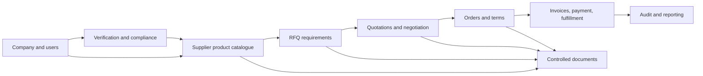

# Recommended Chemical Marketplace Data Model

## Objective

Chemidot should evolve its existing PostgreSQL marketplace into a controlled
B2B chemical transaction platform. The model below extends the current
`users`, `suppliers`, `products`, `rfqs`, `quotations`, `orders`, and
collective purchasing concepts rather than replacing the application.

The design goals are:

- Know the legal company and authorized people behind each transaction.
- Describe chemicals and their documents in comparable, auditable records.
- Preserve the accepted commercial terms from RFQ through delivery.
- Protect sensitive documentation and customer delivery data.
- Support investor diligence with evidence of controls and transaction history.

## Domain Boundaries

## Companies And Company Users

The current account record includes a company name. A professional B2B model
should separate people from legal organizations.

| Entity | Key fields | Purpose |
| --- | --- | --- |
| `companies` | legal name, trading name, registration number, VAT/tax number, country, status, verification level | Legal party to transactions |
| `company_locations` | company, address type, country/city, address, warehouse flags, geodata | Billing, delivery and warehouse addresses |
| `company_users` | company, user, role, capabilities, invited/approved timestamps, status | Multiple authorized users for each buyer/supplier |
| `company_roles` or policy rules | procurement requester, approver, seller, document manager, finance, admin | Least-privilege operations and approval controls |

Recommended rule: a user authenticates personally, but RFQs, quotations and
orders belong to a company and record the acting user.

## Buyer And Supplier Profiles

| Area | Recommended data |
| --- | --- |
| Buyer profile | industries, purchasing locations, procurement categories, billing identity, credit/approval status and buyer verification |
| Supplier profile | company linkage, manufacturer/distributor role, served regions, warehouses, supported shipping modes, support contacts and subscription visibility |
| Commercial eligibility | onboarding status, trading restrictions, approved categories, account suspension reason and effective dates |

The existing `suppliers` record can become the supplier-commercial profile,
but it should point to `companies` rather than treating a single user as the
supplier entity. A comparable buyer-company profile is currently missing.

## Supplier Verification

The existing `verified` boolean is suitable as a display output, not as the
verification record.

Recommended entities and fields:

| Entity | Minimum fields |
| --- | --- |
| `verification_cases` | company, verification type, status, submitted/reviewed by, decision reason, timestamps |
| `company_documents` | company, document type, storage key, issuer, issue/expiry dates, visibility, validation status |
| `supplier_certifications` | certification type, identifier, scope/products/sites, issuing authority, expiry, verification case |
| `compliance_reviews` | reviewer, criteria, findings, action required, approved/rejected state |

Verification types should cover commercial registration, tax/VAT identity,
bank/payment onboarding when relevant, quality management certificates,
manufacturer authorization, and region-specific regulated-product evidence.

## Chemical Product Technical Data

The current product includes `name`, `cas_number`, generic `technical_specs`,
packaging and country of origin. Retain it as a listing concept, but normalize
technical identity and sellable variants.

| Entity | Recommended fields |
| --- | --- |
| `chemical_substances` | preferred name, CAS number, EC number, UN number, HS code, formula, hazard class, GHS signal word, transport class |
| `products` | supplier/company, substance, product family, trade name, publication status and category |
| `product_variants` | grade, concentration/purity, form, application grade, origin, shelf life, storage requirements, temperature constraints |
| `packaging_options` | variant, package type, net quantity/unit, pallet/container details, dangerous goods suitability |
| `product_availability` | variant, warehouse/location, MOQ, lead time, currency, available quantity window |
| `product_specifications` | variant, property, method/standard, min/max/target, unit |

Some properties differ materially by product type. For example a polymer may
require melt flow index and density; an acid may require concentration and
trace impurities. Structured specification records allow comparison without
forcing every property into a single wide table.

## Chemical Documents

Chemical transactions require more than a link attached to a storefront.

### Document Types

| Document | Business use |
| --- | --- |
| SDS/MSDS | Safety, hazard, storage, transport and handling information; SDS is the modern controlled term |
| TDS | Technical performance/specification sheet |
| COA | Lot/batch-specific analytical conformity evidence |
| Compliance declaration | REACH or applicable regional declarations, restricted substances, import requirements |
| Quality certificate | Supplier/manufacturer capability evidence |
| Proforma/commercial invoice | Commercial fulfillment and finance document |
| Packing list, bill of lading, delivery proof | Shipment evidence |

### Recommended Document Model

| Entity | Minimum fields |
| --- | --- |
| `documents` | type, private storage object key, file name/type/size, checksum, version, issuer, effective/expiry dates, owner company, sensitivity, validation state, scan state |
| `document_links` | document, resource type/id such as product variant, RFQ, quote, order, lot or shipment, relationship and required flag |
| `document_access_events` | user, company, document, access action, time and decision |
| `document_reviews` | reviewer, decision, findings and date |

Documents should be private by default. Users should receive authorized,
time-limited access only after the application evaluates company role,
transaction relationship and document visibility.

## RFQ Model For Chemicals

The current RFQ captures product name, optional CAS, quantity, destination and
deadline. A professional chemical RFQ should add a request header plus one or
more chemical requirement line items.

| Area | Required fields for a professional RFQ |
| --- | --- |
| Ownership | buyer company, requester, approver if required, request number, status and submission deadline |
| Chemical identity | substance/CAS, grade, purity/concentration, physical form, intended application where relevant |
| Quantity | amount, unit, tolerance, recurring demand or one-time order |
| Packaging | required packaging, pallet/IBC/tanker/container needs, labeling requirements |
| Compliance | SDS required, TDS/COA required, certification/regulatory requirements, prohibited substitutions |
| Delivery | destination location, required delivery date/window, Incoterm, transport constraints and dangerous goods needs |
| Commercial | quote currency, payment terms requested, tax treatment, quote validity requirement, confidentiality |
| Matching | invited suppliers, allowed substitutions, evaluation criteria and award outcome |
| Attachments | specification document, quality template, purchase terms and required response documents |

Keep current RFQs operational while designing these structures; do not bury
new regulated fields in a single free-text `specifications` value.

## Quotation Model For Chemicals

| Area | Required quotation fields |
| --- | --- |
| Identity | responding supplier company and user, RFQ line item, quote version/status and validity |
| Material response | offered product/variant, manufacturer, origin, grade, purity/concentration, substitution disclosure |
| Commercial terms | quantity offered, unit price, currency, discounts, taxes, freight/insurance, total landed calculation |
| Delivery | lead time, delivery window, Incoterm/version and place, packaging, available quantity and shipment mode |
| Payment | payment terms, credit terms or deposit requirements |
| Compliance | SDS/TDS attachments, representative COA or COA commitment, compliance declarations and deviations |
| Negotiation | versioned counter offers, actor, accepted terms and reason for rejection/withdrawal |

The accepted quotation must be snapshotted into the order; later catalogue or
quote edits must not silently change agreed terms.

## Order, Invoice, Payment, Fulfillment And Audit

| Domain | Needed records and controls |
| --- | --- |
| Order | order header, company parties, accepted quotation reference, immutable line-item terms, delivery locations, approvals and lifecycle events |
| Purchase order | buyer-issued PO number/document and matching status, when enterprise buyers require it |
| Invoice | proforma/commercial invoice records, invoice number, line amounts, tax, currency, issuer/recipient, due date, controlled document |
| Payment | expected amount, payment status, transaction/reference, received amount/date, evidence document, reconciliation actor |
| Fulfillment | shipment, dangerous goods details, carrier, tracking, batches/lots, dispatch/delivery events and proof of delivery |
| Quality | batch/lot, COA, acceptance/rejection, complaint/claim and resolution |
| Audit | append-only events for authentication-sensitive changes, verification, document decisions, quote acceptance, order changes, finance and access to sensitive files |

Collective procurement should create per-buyer commercial allocations that can
either become orders or link to the same invoice/payment/fulfillment
framework. Maintaining a second incomplete execution model will create
reporting and control problems.

## Recommended Additions By Timing

### Add Now: Foundation Before Feature Expansion

1. Define `companies`, `company_users`, roles/capabilities, and buyer/supplier
   ownership boundaries.
2. Define structured chemical substance/product-variant requirements and
   canonical identifiers.
3. Define a private, versioned document model supporting SDS, TDS, COA,
   compliance and invoices.
4. Define revised RFQ and quotation requirements, including Incoterms,
   packaging, compliance attachments and accepted-term snapshots.
5. Define order provenance, events, invoice/payment/fulfillment boundaries and
   full audit requirements.
6. Decide how collective allocations converge into normal execution records.
7. Establish data migration/backfill mapping from the current MVP fields.

### Add Next: Controlled Commercial Pilot

1. Company onboarding and verification workflow.
2. Private document storage and authorization.
3. Product technical specification and SDS/TDS publication workflow.
4. Enhanced RFQ, quotation and order traces.
5. Invoice/payment status backed by actual records and audit events.
6. Verified-purchase review eligibility and basic dispute support.

### Add Later: Scale And Enterprise Depth

1. ERP/procurement integrations and electronic purchase orders.
2. Batch/lot COA workflows, quality disputes and claims.
3. Freight/carrier integration and dangerous goods transport automation.
4. Credit underwriting, payment service/provider integration and settlement.
5. Advanced analytics, recommendation/search indexing and multi-region AWS
   service design only when justified by load and operating needs.

## Mapping From Current Model

| Current field/entity | Recommended treatment |
| --- | --- |
| `users.company_name` | Backfill candidate for `companies`; keep temporarily for display compatibility |
| `suppliers.user_id` | Transition to company ownership plus company-user permissions |
| `suppliers.verified` | Derived presentation flag from latest approved verification case |
| `suppliers.certifications[]` | Backfill into versioned certification records with evidence |
| `products.cas_number` | Match to canonical chemical substance identifier |
| `products.technical_specs` | Backfill selectively to structured product specifications |
| `products.sds_document_url` and `supplier_documents` | Import as document metadata pending review; do not treat as validated evidence automatically |
| `rfqs.specifications` | Preserve as legacy notes while adding structured requirements |
| `orders` invoice URLs/status flags | Preserve for legacy display while introducing finance/document records |

## Data Model Conclusion

The existing schema should be retained as the source for a controlled
refactor. It demonstrates marketplace and workflow intent, but it is not yet
sufficient for a professional chemical transaction platform without
organization, compliance-document, structured technical, finance,
fulfillment and audit entities.
