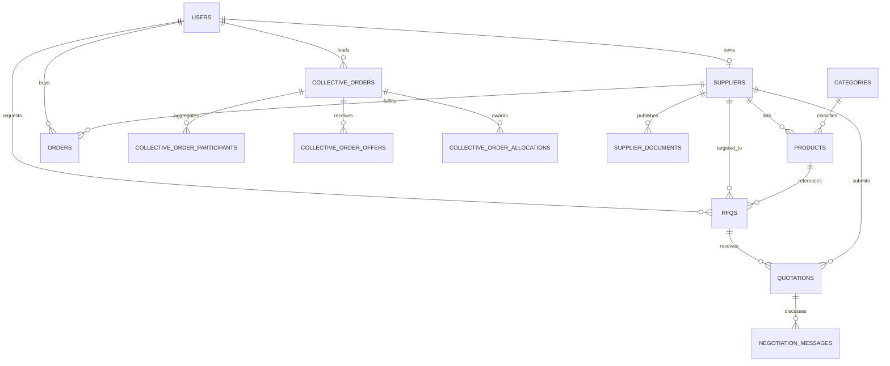

# Chemidot Current Database Map

## Scope And Evidence

This document records the database and route-layer model present on
`docs/platform-foundation-audit`. It is an architecture audit only; it does
not propose that any migration has already been approved or executed.

Primary sources inspected:

- `lib/db/src/index.ts`
- `lib/db/src/schema/*.ts`
- `lib/db/drizzle/0000_add_indexes.sql` through
  `lib/db/drizzle/0010_buyer_led_collective_orders.sql`
- `artifacts/api-server/src/middlewares/auth.ts`
- `artifacts/api-server/src/routes/*.ts`
- `lib/api-zod/src/generated/api.ts`
- `scripts/src/*.ts`, `scripts/push-db-if-configured.mjs`, and reset-password scripts

## Current Database Architecture Summary

Chemidot uses PostgreSQL through Drizzle ORM and the `pg` connection pool.
The runtime requires `DATABASE_URL`; the connection normalizes
`sslmode=require` to certificate-verifying TLS. The model is relational and
organized around:

- Accounts and supplier storefronts.
- Product catalogue and categories.
- RFQs, quotations, negotiations, and resulting orders.
- Buyer-led collective purchasing.
- Messaging, notifications, reviews, and showcase projects.
- Supplier subscription administration and limited audit logging.

The schema represents a functional marketplace MVP and increasingly detailed
deal workflows. It is not yet a full chemical trade system: organization
identity, controlled document records, chemical compliance, batch/lot
traceability, logistics, payment accounting, and broad auditability remain
incomplete.

## Entity Inventory

### Identity, Supplier And Catalogue

| Entity | Business purpose | Important current fields | Relationships |
| --- | --- | --- | --- |
| `users` | Authenticated human account and currently also a partial company identity | `email`, `password_hash`, `role`, `can_buy`, `can_sell`, `company_name`, `industry`, `country`, `status` | Parent of RFQs, orders, conversations, messages, notifications, reviews, collective participation and supplier ownership |
| `suppliers` | Supplier storefront and subscription state | `user_id`, `company_name`, `commercial_reg_number`, `certifications[]`, `verified`, `supplier_plan`, `subscription_status`, visibility and access flags | Belongs to one `users` row; parent of products, documents, brands, experts, quotes, orders and offers |
| `admin_audit_logs` | Limited trail of admin supplier subscription actions | `admin_user_id`, `supplier_id`, `action`, `details_json`, `created_at` | References admin user and optionally supplier |
| `categories` | Product catalogue grouping | `name`, `name_ar`, `slug`, `icon_url` | Parent of products and optional RFQ categorization |
| `products` | Supplier-listed chemical product offering | `supplier_id`, `category_id`, `name`, `cas_number`, `moq`, `base_price`, `country_of_origin`, `packaging`, `sds_document_url`, `technical_specs`, `pricing_tiers` | Belongs to supplier/category; optionally selected by RFQs, orders and collective orders |
| `supplier_brands` | Public supplier brand/profile content | `supplier_id`, `name`, `logo_url`, `description` | Belongs to supplier |
| `supplier_documents` | Public supplier document link catalogue | `supplier_id`, `title`, `type`, `file_url`, `file_size` | Belongs to supplier; not linked to product, RFQ, quote, order, version, or approval |
| `supplier_experts` | Public technical/contact profile content | `supplier_id`, `name`, `title`, `email`, `avatar_url` | Belongs to supplier |
| `projects` | Public marketing/case-study content | `slug`, `summary`, `chemicals_used[]`, `supplier_id`, `featured` | Optionally belongs to supplier |

### Procurement And Deal Execution

| Entity | Business purpose | Important current fields | Relationships |
| --- | --- | --- | --- |
| `rfqs` | Buyer request for a quotation | `buyer_id`, optional `supplier_id`/`product_id`/`category_id`, `product_name`, `cas_number`, `quantity`, `unit`, `delivery_destination`, `delivery_deadline`, `specifications`, `status` | Buyer owns; may target product/supplier/category; parent of quotations |
| `quotations` | Supplier price response to an RFQ | `rfq_id`, `supplier_id`, `price_per_unit`, `currency`, `delivery_time`, `valid_until`, `notes`, `status` | Belongs to RFQ and supplier; parent of negotiation messages |
| `negotiation_messages` | RFQ quotation discussion and simple counter offer trail | `quotation_id`, `sender_id`, `sender_role`, `type`, `content`, `proposed_price`, `proposed_delivery_time` | Belongs to quotation and sending user |
| `orders` | Commercial transaction and current execution record | `buyer_id`, `supplier_id`, optional `product_id`, unlinked `rfq_id`/`quotation_id`, amount/currency, `status`, `deal_stage`, payment/fulfillment/invoice fields, final terms, fee fields | Belongs to buyer/supplier and optionally product; created from accepted quotation or directly |

### Collective Procurement

| Entity | Business purpose | Important current fields | Relationships |
| --- | --- | --- | --- |
| `collective_orders` | Demand aggregation led by a buyer | optional `product_id`/`supplier_id`, `created_by_buyer_id`, target/current quantity, pricing tiers, status/stage, selected-offer identifiers, allocation sharing flags, deadline and region | Parent of participants, offers and allocations |
| `collective_order_participants` | Buyer commitment during demand gathering | `collective_order_id`, `buyer_id`, `quantity`, `delivery_destination`, `payment_terms` | Links collective order to buyer |
| `collective_order_offers` | Supplier bid for aggregated demand | `collective_order_id`, `supplier_id`, `unit_price`, `available_qty`, `lead_time`, `incoterms[]`, `payment_terms`, validity | Unique per collective order and supplier |
| `collective_order_allocations` | Confirmed per-buyer awarded allocation | `collective_order_id`, `buyer_id`, quantity and price snapshots, delivery/contact details, invoice/payment/fulfillment statuses and invoice URLs | Unique per collective order and buyer |

### Engagement And Communications

| Entity | Business purpose | Important current fields | Relationships |
| --- | --- | --- | --- |
| `conversations` | Direct buyer-to-supplier-user conversation | `buyer_id`, `supplier_id`, `last_message_at` | Both foreign keys reference `users`, rather than companies or supplier profiles |
| `messages` | Conversation content | `conversation_id`, `sender_id`, `content`, `is_read` | Belongs to conversation and sending user |
| `notifications` | User event inbox | `user_id`, `type`, `related_id`, `related_type`, `is_read` | Belongs to user; relationship to business object is polymorphic text/id, not a foreign key |
| `reviews` | Buyer-visible product rating | `product_id`, `buyer_id`, `rating`, `comment` | Links product and user; not linked to completed purchase |

## Principal Relationships

Important relationship gaps:

- `orders.rfq_id` and `orders.quotation_id` are stored as integers but are not
  declared as foreign keys in the Drizzle schema or initial migration.
- `collective_orders.recommended_offer_id` and `selected_offer_id` are stored
  as integers without declared foreign keys to `collective_order_offers`.
- `notifications.related_id` is intentionally flexible but has no referential
  integrity.
- A `supplier` is owned by one `user`; there is no company membership model.

## Route-Level Access Map

This section describes observed application authorization. Direct database
access and operational scripts can bypass these routes.

| Entity | Read access observed | Create access observed | Update/delete access observed |
| --- | --- | --- | --- |
| `users` | Current user; admin list | Public registration | User profile/password; admin status/role |
| `suppliers` | Public visible storefront; owner profile; admin | Registration/profile capability creation; admin can ensure profile | Supplier owner profile; admin verification/subscription/visibility |
| `admin_audit_logs` | Admin supplier administration response exposes recent entries | Subscription administration helper | No general editing route found |
| `categories` | Public | Admin; base-data script | Admin |
| `products` | Public when storefront/products are visible; admin | Seller-capable supplier | Owning supplier; admin; owner delete |
| `supplier_brands` | Public visible supplier | Seller-capable owner | Seller-capable owner |
| `supplier_documents` | Public visible supplier | Seller-capable owner submits metadata/URL | Seller-capable owner; no verification approval flow found |
| `supplier_experts` | Public visible supplier | Seller-capable owner | Seller-capable owner |
| `projects` | Public | Seed script found; no create API found | No update API found |
| `rfqs` | Owning buyer; eligible/targeted supplier; admin | Buyer-capable account | Owning buyer; admin status; buyer can delete before award |
| `quotations` | RFQ buyer/admin; supplier sees its eligible quotation context | Seller-capable eligible supplier | Buyer accepts/rejects; negotiated counter offers update terms |
| `negotiation_messages` | RFQ buyer or quotation supplier | RFQ buyer or quotation supplier while pending/active | No delete/update route found |
| `orders` | Buyer, assigned supplier, admin | Buyer directly or transactional acceptance of quotation | Supplier final terms/invoice/status; buyer confirmation/status; admin stages/payment/fulfillment/fee |
| `collective_orders` | Public listing/detail with restricted details | Buyer-capable lead buyer | Lead buyer, selected supplier for specific actions, admin |
| `collective_order_participants` | Detail response redacts according to viewer | Buyer-capable participant join | Participant leave; detail visibility depends on sharing |
| `collective_order_offers` | Admin/lead buyer or supplier-owned filtered view | Seller-capable supplier | Seller resubmission updates its offer; admin/lead selection |
| `collective_order_allocations` | Participant, approved selected supplier, admin | Participating buyer confirms | Workflow administration; no full ledger/audit trail found |
| `conversations` | Conversation participants | Buyer starts supplier conversation | Last-message timestamp changes when participants send; no moderation/audit route found |
| `messages` | Conversation participants | Conversation participants | Recipient reads mark messages read; no edit/delete route found |
| `notifications` | Owning user | Application event handlers | Owning user marks read |
| `reviews` | Public | Any authenticated account | No verified-purchase check or edit/delete route found |

## Business Meaning Of Current Flows

### RFQ To Order

1. A buyer-capable account creates an RFQ for a product name/CAS, quantity and
   delivery destination/deadline, optionally linking a catalogue product or
   supplier.
2. Eligible supplier accounts submit one quotation per RFQ.
3. Buyer and supplier may negotiate price or lead time through quotation
   messages.
4. Buyer accepts a pending valid quotation; a transaction creates an order,
   marks the RFQ awarded, accepts that quotation, and rejects alternatives.
5. The order supports supplier confirmation, admin review, buyer final
   confirmation, invoice URL submission, administrative payment/fulfillment,
   and platform success-fee handling.

There is also a direct buyer `POST /orders` path that is not inherently tied
to an RFQ or quotation.

### Collective Purchasing

A buyer creates aggregated demand, buyers join, supplier offers may open, a
lead buyer or admin selects an offer, each participant confirms an allocation,
the allocation list is shared with the supplier after approval, and execution
continues. This is commercially useful but is a second workflow beside
ordinary `orders`, with limited linkage to invoices, payments, fulfillment
events, documents or platform fees.

## Current Risks And Unclear Fields

| Area | Finding | Business risk |
| --- | --- | --- |
| Company identity | `users.company_name` and `suppliers.company_name` stand in for an organization; a supplier has one owner user | Cannot represent procurement teams, delegated authority, approval limits, multi-site companies or durable KYC identity |
| Roles | `role` is combined with `can_buy`/`can_sell`; two concepts can diverge | Authorization and reporting can become ambiguous as multi-role companies grow |
| Supplier verification | `verified` is boolean; certifications are unstructured text | No documented evidence, reviewer, expiry, rejection reason or renewal cycle |
| Chemical product data | CAS exists, but many technical properties are free JSON/text; one SDS URL is available; seeded `technical_specs` labels do not match the API's named shape consistently | Cannot reliably search, validate or compare regulated chemical offers |
| Documents | Supplier documents are public URL metadata, product SDS is a URL, invoices are URLs | No private access policy, versioning, expiry, product/batch/order binding, scan/checksum, approval or audit history |
| RFQ | RFQ represents one product in free text and has minimal technical/delivery detail | Quotations may not be comparable or legally/commercially sufficient for chemical procurement |
| Quotation | Missing structured freight, Incoterms on ordinary quotes, packaging, compliance response and attachments | Accepted quote may not capture complete final terms |
| Orders | Multiple status tracks coexist; order provenance references are not foreign keys; direct creation bypasses quotation | Weak traceability and risk of inconsistent deal state |
| Payments/invoices | Status flags and URL fields exist without invoice/payment entities | No reconciliation, amounts paid, payment proof, due dates, tax, or immutable accounting trail |
| Collective procurement | Separate allocation workflow stores contact information and invoice URLs | Privacy/control and reconciliation gaps; difficult to consolidate revenue and risk |
| Reviews | Authenticated user can submit a product review without completed-order evidence | Trust and marketplace quality risk |
| Audit | Audit logging is focused on subscription administration | No full change history for verification, documents, RFQs, offers, orders or payment actions |
| Destructive operations | Cleanup, reset, seeding, admin promotion and schema-push scripts exist | Requires operational controls, approvals and separated production procedures |

## Missing Entities For A Professional Chemical Marketplace

The following are model gaps, not instructions to migrate immediately.

### Add In The Foundation Phase

| Needed entity | Why it is needed |
| --- | --- |
| `companies` and `company_users` | Separate legal/company identity from humans; roles and invitations per company |
| `company_locations` and `company_verification_cases` | Addresses, registration, VAT/tax, KYC/KYB review and approvals |
| `supplier_qualifications` / `supplier_certificates` | Evidence-backed verification with issuer, expiry, scope and review status |
| `chemical_substances` | Canonical chemical identity: CAS, EC/UN identifiers, names and hazard baseline |
| `product_variants` or `product_specs` | Grade, purity/concentration, form, packaging and structured technical attributes |
| `documents` and `document_links` | Private versioned SDS/TDS/COA/compliance/invoice metadata and controlled linkage |
| `rfq_line_items` and `rfq_requirements` | Structured and potentially multi-product buyer technical requirements |
| `quotation_line_items`, `quotation_terms`, `quotation_documents` | Comparable commercial/technical supplier response |
| `order_line_items` and `order_events` | Immutable ordered terms and traceable state changes |
| `audit_events` | Actor, company, action, resource, timestamp and controlled metadata across critical workflows |

### Add As Transactions Mature

| Needed entity | Why it is needed |
| --- | --- |
| `invoices`, `invoice_lines`, `payments`, `payment_events` | Commercial reconciliation and finance readiness |
| `shipments`, `shipment_events`, `delivery_documents` | Fulfillment, dangerous goods transport and proof of delivery |
| `lots` / `batches` and `certificates_of_analysis` | COA and traceability tied to delivered chemical material |
| `compliance_declarations` and `regulatory_regions` | Regional restrictions and compliance evaluation |
| `approvals` and `purchase_orders` | Enterprise procurement governance |
| `disputes`, `returns`, `claims` | Quality and delivery resolution |

## Fitness Assessment

The current schema is usable as an MVP foundation and should be refactored,
not discarded. PostgreSQL is a strong fit for this connected, transactional
domain. The schema is not yet sufficient to represent professional chemical
trade safely because core compliance and organization concepts are currently
stored as flags, URLs, text, or not represented at all.
