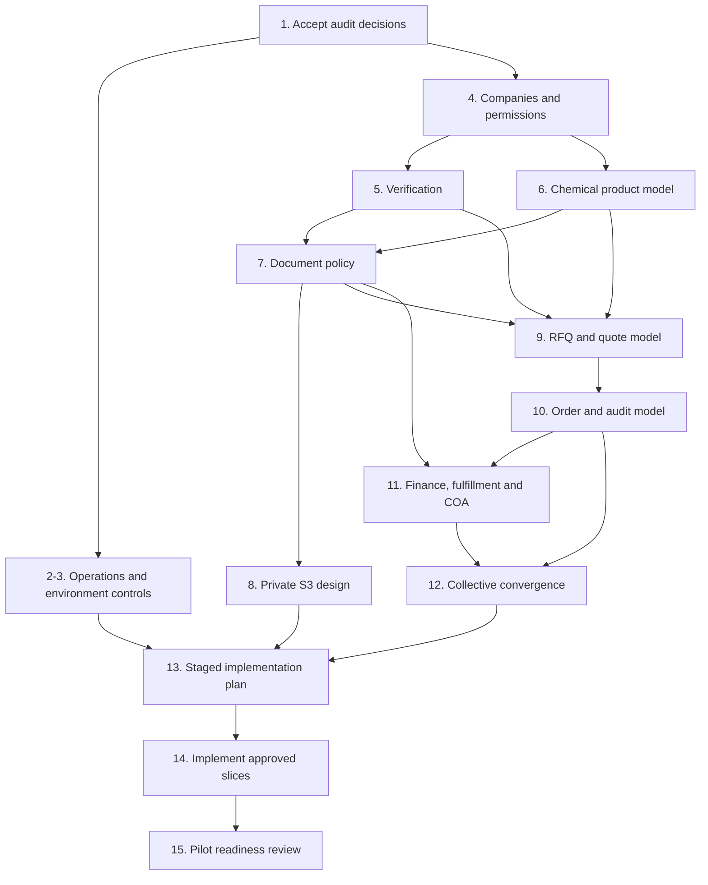

# Chemidot Foundation Roadmap

## Executive Recommendation

**Recommendation: keep and refactor. Do not rebuild and do not migrate the
primary database to DynamoDB now.**

Chemidot already has an operational marketplace skeleton: accounts,
supplier/product discovery, RFQs, quotation negotiation, ordinary orders,
collective purchasing and admin workflows. The safe path is to protect that
investment while fixing the foundation needed for professional chemical trade:
company identity, verification, controlled technical documents, structured
chemical data, traceable commercial records, operational safety and audit.

## How To Use This Roadmap

- Review this roadmap before starting any new feature.
- Each implementation task should use its own branch and PR.
- Documentation-only tasks must not change production behavior.
- Schema changes require a separate approved migration plan.
- AWS migration should only start after the foundation model and operational
  controls are approved.

## Decision Summary

| Strategic question | Answer |
| --- | --- |
| PostgreSQL fit | Good fit; retain it as the transactional system of record |
| Current schema | Useful MVP foundation; insufficient as-is for professional chemical commerce |
| Critical missing domain areas | Companies/membership, chemical substance/variants, verified documents, RFQ/quote technical terms, invoice/payment/fulfillment records, lots/COA and audit |
| AWS timing | Incremental later, after foundation mapping and controls |
| DynamoDB timing | Do not use as the primary database now |
| Rebuild decision | Do not rebuild; evolve intentionally |
| First AWS candidate | Private S3 storage for controlled documents after access/data model design |

## Must-Fix Work Before New Marketplace Features

These are priorities to plan and implement in later scoped changes; no such
behavior is changed by this document.

| Priority | Must-fix concern | Why it blocks confident expansion |
| --- | --- | --- |
| P0 | Remove database push/forced schema modification from deployment build workflows through a separately approved change | A deployment must not unexpectedly alter production data structures or seed data |
| P0 | Inventory and govern database/admin/password/cleanup scripts | Investor and production review requires controlled privileged operations |
| P0 | Decide company, user membership and authorization model | B2B transactions cannot be safely owned by free-form company names and one supplier login |
| P0 | Specify private document architecture and access rules | Chemical and invoice evidence should not depend on uncontrolled URLs or temporary runtime storage |
| P1 | Specify structured chemical product and compliance model | Buyers need trustworthy comparisons and compliance evidence |
| P1 | Normalize RFQ/quotation/order provenance and accepted terms | Awarded transactions require traceability and comparable terms |
| P1 | Define audit event coverage and data retention | Critical changes need an evidence trail |
| P1 | Define payment, invoice and fulfillment boundaries | Status flags alone are inadequate for commercial operations |
| P2 | Unify collective allocation execution with ordinary transaction records | Parallel incomplete flows weaken reporting and controls |
| P2 | Tie reviews to eligible completed purchases | Marketplace trust depends on verified feedback |

## Technical Roadmap Phases

### Phase 0: Control The Existing Foundation

Goal: establish operational confidence before material feature growth.

- Approve and implement deployment-safe database migration procedures.
- Restrict and document privileged scripts and secrets handling.
- Confirm staging/production separation, backup/recovery and release checks.
- Establish architecture decision records and data ownership rules.

Exit evidence: deployments do not implicitly modify schemas or seed records;
privileged operations have a reviewed process; release and recovery
responsibilities are explicit.

### Phase 1: Model The Professional Chemical Domain

Goal: approve data structures before introducing irreversible implementation.

- Define company/users, roles, buyer and supplier verification.
- Define chemical substance, product variant, specification and packaging
  structures.
- Define private documents, document links, versions and review/access rules.
- Define RFQ, quotation, order, audit and collective-convergence requirements.
- Produce migration/backfill and API compatibility plan.

Exit evidence: signed-off ERD, authorization matrix, document classification
policy and staged migration plan.

### Phase 2: Build The Controlled Marketplace Core

Goal: implement the approved foundation in incremental, backward-compatible
work items.

- Add company onboarding and controlled supplier verification.
- Introduce private document metadata and AWS S3 storage for protected files.
- Add structured chemical catalogue data and document publication workflow.
- Strengthen RFQ-to-order traceability and audit events.

Exit evidence: a verified supplier can publish a controlled product with
approved SDS/TDS and a verified buyer can execute a traceable RFQ award.

### Phase 3: Commercial Execution And Pilot Readiness

Goal: support credible paid transactions.

- Add invoice, payment, shipment, delivery-document and COA/lot records.
- Converge collective purchasing execution into the same controls.
- Establish support, claims and verified-review process.
- Build operating dashboards and investor evidence metrics.

Exit evidence: end-to-end pilot transaction evidence, transaction audit
history, document access records and reconciliation reporting.

### Phase 4: Platform Expansion Only From Evidence

Goal: make infrastructure decisions based on measured needs.

- Evaluate database/API hosting on AWS against security, networking,
  compliance, workload and cost evidence.
- Consider managed PostgreSQL on AWS while retaining the relational model.
- Consider DynamoDB only for demonstrated specialized access patterns, not as
  an assumed replacement for core transactions.

Exit evidence: architecture/business case with measurable triggers and a
reversible migration approach.

## First 15 Tasks In Order

| Order | Task | Output | Depends on |
| --- | --- | --- | --- |
| 1 | Approve this audit's strategic decisions and risk register | Accepted scope and decision record | None |
| 2 | Produce a deployment and privileged-operations remediation plan | Reviewed plan for DB migrations, scripts, backups, access and rollback | 1 |
| 3 | Map current production/staging data ownership and release responsibilities without exposing secrets | Environment/control inventory | 1, 2 |
| 4 | Design the company, membership, role and permission model | ERD and authorization matrix | 1 |
| 5 | Design supplier/buyer verification and certification workflow | Verification states, evidence and reviewer rules | 4 |
| 6 | Design the canonical chemical substance, product variant and specification model | Chemical catalogue ERD/data dictionary | 4 |
| 7 | Define document classes, access rules, versioning, retention and review lifecycle | Document security policy and metadata schema | 5, 6 |
| 8 | Design the first AWS addition: private S3 document storage and application authorization boundary | S3/IAM/presigned-access/scanning design | 7 |
| 9 | Redesign RFQ requirements and quotation response terms for chemicals | RFQ/quote contract and comparison rules | 5, 6, 7 |
| 10 | Design ordinary order provenance, accepted-term snapshots and audit events | Order/event model and transition rules | 4, 9 |
| 11 | Design invoice, payment, shipment, batch/COA and delivery-proof records | Execution/finance model | 7, 10 |
| 12 | Decide how collective orders create or connect to execution records | Unified collective transaction design | 9, 10, 11 |
| 13 | Create a staged schema/API/backfill implementation plan with rollback points | Incremental delivery plan | 4-12 |
| 14 | Implement and validate the highest-risk operational hardening and first approved foundation slice | Reviewed code and test evidence in separate implementation work | 2, 13 |
| 15 | Run a controlled pilot-readiness review using a full buyer-to-delivery scenario | Investor evidence pack and go/no-go list | 14 |

## Dependency View

## Investor Readiness Milestones

| Milestone | What an investor or enterprise customer can see |
| --- | --- |
| Foundation decision complete | Clear keep/refactor strategy, domain gaps and disciplined AWS decision |
| Operations controlled | Deployment and privileged-data operations documented and governed |
| Trust model approved | Company identities, authorized users and supplier verification evidence design |
| Chemical catalogue controlled | Structured product identifiers/specifications plus managed SDS/TDS/compliance publication |
| Transaction traceability | RFQ, quote award, order terms and audit events connected without ambiguity |
| Document security demonstrated | Private document access, versioning and access logging through a bounded AWS storage capability |
| Pilot transaction complete | A defensible end-to-end trade with invoice/payment/fulfillment/COA evidence and reporting |
| Scale decision supported | AWS/backend investment driven by measured needs and compliance requirements |

## Risk Register

| Risk | Severity | Near-term mitigation objective |
| --- | --- | --- |
| Deploy builds can alter database schema/data | Critical | Separately control and approve database migrations before production expansion |
| No legal company/membership ownership model | High | Approve company and permission design before onboarding serious counterparties |
| Document links and temporary upload behavior are not a protected chemical-document system | High | Define private S3/document access architecture and metadata lifecycle |
| Product/RFQ/quote data lack required chemical structure | High | Approve substance/specification and technical requirement dictionaries |
| Transaction provenance, payment, fulfillment and audit are incomplete | High | Define unified execution records and event trail |
| Supplier verification is represented largely by a boolean and text list | High | Add evidence-backed review model |
| Collective workflow is commercially separate from standard order execution | Medium | Map it into unified order/invoice/fulfillment controls |
| Review eligibility is not demonstrated by purchase completion | Medium | Gate trust signals to verified transactions |

## Next Recommended Task

The next task after this documentation is **Task 2: produce and approve a
deployment and privileged-operations remediation plan**, beginning with the
observed database schema-push behavior in deployment/build scripts and the
inventory of privileged database/admin scripts. This should be a design and
approval step first, followed by a separately scoped implementation change.

This comes before new features because it reduces the risk that routine
deployment or maintenance changes alter data while the professional domain
model is being designed.
